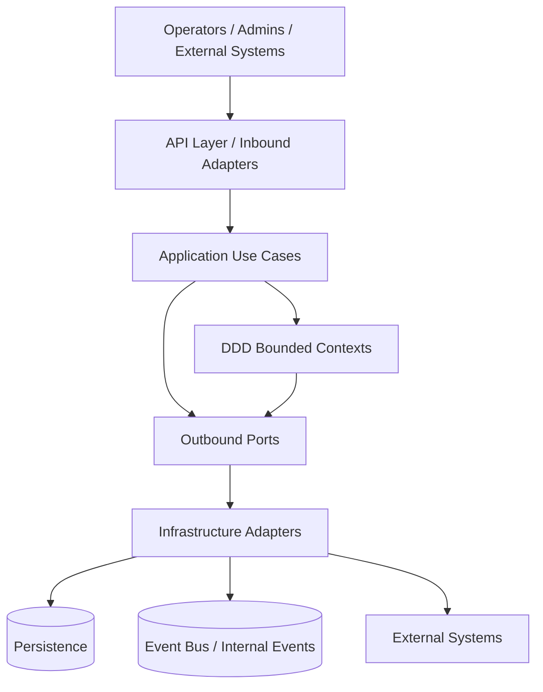
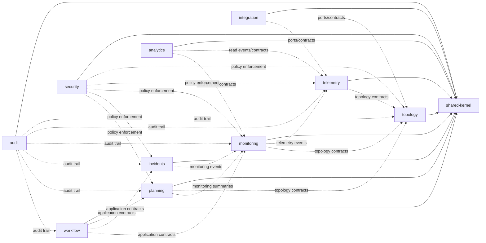
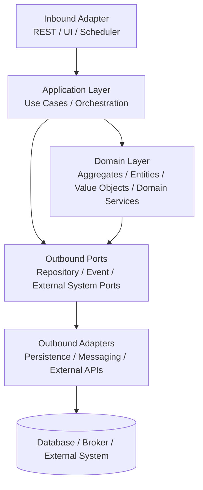
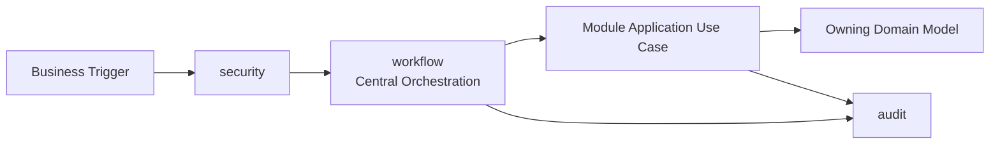
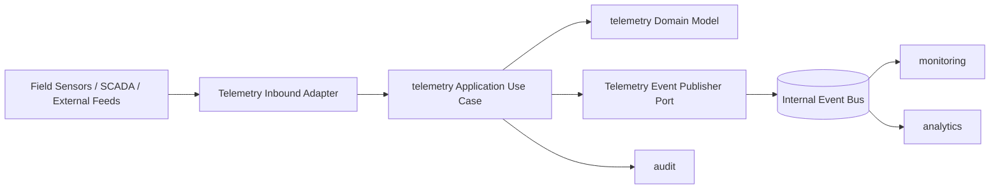
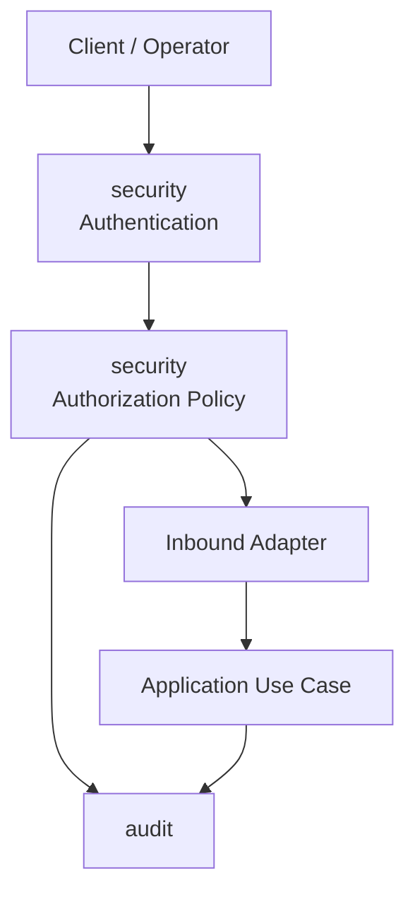

# MASTER ARCHITECTURE INDEX

**Project:** HyFlo — Sonatrach Oil & Gas Pipeline Management Platform  
**Target Architecture:** DDD + Hexagonal Architecture + Modular Monolith  
**Document Purpose:** Cross-phase validation, consolidation, consistency audit, standardization, and execution readiness verdict  
**Generated From:** Uploaded master validation prompt  
**Repository Mutation:** None. This document is a standalone generated artifact and does not modify the repository.

---

## 0. Validation Scope & Evidence Status

This document is generated as the required single source of truth for `/docs/architecture/MASTER-ARCHITECTURE-INDEX.md`.

However, the actual Phase 1 → Phase 5 artifacts were not available in the current execution context. Therefore, this file performs a **constraint-based consolidation** using the master prompt requirements and clearly marks all items that require verification against the missing phase documents and repository inventory.

### Available Evidence

| Evidence | Status | Impact |
|---|---:|---|
| Master validation prompt | Available | Defines required bounded contexts, standards, checks, and output structure. |
| Phase 1 — Repository Discovery | Missing | Repository reality cannot be verified. |
| Phase 2 — Application Layer Audit | Missing | Application-layer violations cannot be confirmed. |
| Phase 3 — Domain & Module Architecture | Missing | Target module model cannot be cross-checked. |
| Phase 4 — Target Architecture Design | Missing | Architecture design consistency cannot be fully validated. |
| Phase 5 — Commit / Execution Roadmap | Missing | Roadmap sequencing and commit integrity cannot be validated. |
| Repository source tree | Missing | Code-level architecture, naming, validation, dependency, and documentation checks cannot be executed. |

### Validation Method Applied

Because the phase artifacts are unavailable, this document applies the following governance rules:

1. Preserve only bounded contexts explicitly required by the master prompt.
2. Do not introduce new modules, features, services, or architectural concepts beyond the prompt.
3. Mark all cross-phase findings as **verification-blocked** where source evidence is missing.
4. Produce a clean normalized architecture index suitable for repository execution only after evidence gaps are resolved.

---

## 1. Global Architecture Overview

HyFlo is consolidated as an enterprise oil and gas pipeline management platform intended for Sonatrach operational environments. The architecture target is a **modular monolith** structured around explicit DDD bounded contexts, protected by hexagonal ports/adapters boundaries, with centralized workflow, security, and audit capabilities.

The architecture must remain a modular monolith unless a later approved decision record explicitly authorizes decomposition. No distributed-service assumptions are accepted by default.

### Confirmed Architectural Principles

| Principle | Final Rule |
|---|---|
| Domain-first modularity | Modules are organized by bounded context, not by technical layer names. |
| Hexagonal boundaries | Domain and application logic depend on ports, not adapters. |
| Modular monolith | Modules are deployable together but logically isolated. |
| Strict dependency direction | Controllers → application → domain → ports; infrastructure implements ports. |
| No cross-module entity sharing | Modules communicate through application contracts, events, or integration DTOs only. |
| Shared kernel minimalism | Shared kernel contains only stable primitives, identifiers, base value objects, and cross-module contracts. |
| Workflow centralization | Workflow orchestration is centralized and does not leak business rules into adapters. |
| Security centralization | Authentication, authorization, and policy enforcement are centralized and reusable. |
| Audit cross-cutting only | Audit records facts and decisions but does not own business workflow. |

### Confirmed Bounded Contexts

The only confirmed bounded contexts are:

1. **topology**
2. **telemetry**
3. **planning**
4. **monitoring**
5. **incidents**
6. **workflow**
7. **analytics**
8. **integration**
9. **security**
10. **audit**
11. **shared-kernel**

No additional modules are approved in this master index without evidence from the phase documents and repository inventory.

### Confirmed Module Boundary Summary

| Module | Bounded Context Type | Core Responsibility | Boundary Rule |
|---|---|---|---|
| topology | Core domain | Pipeline network topology, assets, segments, stations, physical relationships | Owns topology model; no telemetry or incident business rules inside. |
| telemetry | Core domain | Ingestion-facing telemetry model, measurements, sensor events, quality state | Event-driven; does not own monitoring decisions. |
| planning | Core domain | Operational planning, maintenance planning, scheduled interventions | May consume topology and monitoring summaries through contracts only. |
| monitoring | Core domain | Operational state monitoring, thresholds, health state interpretation | Independent from incident lifecycle ownership. |
| incidents | Core domain | Incident lifecycle, classification, response tracking | Consumes monitoring signals but owns incident state transitions. |
| workflow | Platform/application capability | Cross-context orchestration and approvals | Centralized orchestration; no domain rule duplication. |
| analytics | Supporting domain | Analytical projections, reports, derived insights | Read/derived models only; no source-of-truth ownership of core entities. |
| integration | Supporting/infrastructure-facing | External system integration, import/export boundaries, adapters | Does not own business rules. |
| security | Cross-cutting platform | Authentication, authorization, policy enforcement | Centralized; no module-specific ad hoc security logic. |
| audit | Cross-cutting platform | Audit trails, action history, decision traceability | Records events; does not drive business workflows. |
| shared-kernel | Shared foundation | Stable shared primitives and contracts | Minimal; no business aggregates or module-specific concepts. |

---

## 2. Cross-Phase Consistency Audit

### 2.1 Architectural Drift

Because Phase 1 → Phase 5 artifacts are not available, architectural drift cannot be fully validated. The following normalized drift controls are therefore established as mandatory checks before implementation.

| Drift Area | Expected State | Current Evidence Status | Required Verification |
|---|---|---:|---|
| Missing modules | All 11 confirmed bounded contexts must appear consistently across phases. | Verification blocked | Compare phase module lists against the confirmed module map. |
| Artificial modules | No module outside the 11 confirmed contexts may be introduced without ADR approval. | Verification blocked | Search all phases for non-approved modules such as notification, reporting, asset, admin, users, common, utils, core, infrastructure. |
| Naming drift | Module names must use exact canonical names. | Verification blocked | Normalize all names to lowercase bounded-context names. |
| Bounded-context leakage | Each context must own only its business responsibility. | Verification blocked | Inspect domain model and service responsibilities across phases. |

### 2.2 Canonical Name Register

| Canonical Name | Disallowed / Suspicious Variants |
|---|---|
| topology | asset, assets, network, pipeline, pipeline-network, infrastructure-topology |
| telemetry | sensor, sensors, measurements, data-ingestion, realtime-data |
| planning | maintenance, schedule, scheduling, intervention-planning |
| monitoring | supervision, health, alerts-only, control-room |
| incidents | alerts, events, anomalies, emergency, response |
| workflow | process, bpm, approval, orchestration-engine |
| analytics | reporting, bi, dashboard, insights |
| integration | connectors, external, adapters, api-gateway |
| security | auth, iam, users, access-control |
| audit | history, logs, compliance-log |
| shared-kernel | common, core, utils, foundation, base |

Any occurrence of a suspicious variant must be reviewed. It may be accepted only as a class or subpackage when it clearly belongs inside the canonical bounded context and does not create a parallel module.

---

## 3. Inconsistency Detection

### 3.1 Naming Inconsistencies

| Check | Standard | Status | Required Action |
|---|---|---:|---|
| Module names | Use canonical bounded-context names exactly. | Verification blocked | Scan phases and repository package roots. |
| DTO names | Use `{UseCase}Request`, `{UseCase}Response`, `{Resource}Dto` only where appropriate. | Verification blocked | Remove mixed naming such as VO, Model, Payload, CommandDto unless standardized. |
| Service names | Application orchestration services use `{UseCase}Service` or `{Context}ApplicationService`; avoid Manager. | Verification blocked | Eliminate ambiguous `Manager`, `Helper`, `Util`, `Processor` names unless explicitly justified. |
| Entity names | Domain entities use business names only. | Verification blocked | Avoid persistence or framework suffixes in domain entities. |
| Ports | Use `{Capability}Port` for outbound domain/application ports. | Verification blocked | Ensure adapters implement ports and do not leak inward. |
| Adapters | Use `{Technology}{Capability}Adapter` or `{ExternalSystem}Adapter`. | Verification blocked | Keep technology terms in infrastructure only. |

### 3.2 Architecture Style Inconsistencies

| Area | Expected Standard | Risk If Violated | Status |
|---|---|---|---:|
| DDD | Aggregates, entities, value objects, domain services remain inside domain. | Anemic domain or duplicated business rules. | Verification blocked |
| Hexagonal | Application uses ports; adapters implement ports. | Infrastructure dependency leaks into domain/application. | Verification blocked |
| CQRS | Commands mutate; queries read; projections are explicit if used. | Mixed read/write services and unclear transaction rules. | Verification blocked |
| Layering | Controller → application → domain; repository access only through ports. | Controllers bypass business rules. | Verification blocked |
| Workflow | Workflow orchestrates; domain decides. | Workflow engine becomes business-rule owner. | Verification blocked |

### 3.3 Responsibility Drift

| Responsibility | Owning Context | Anti-Pattern to Detect |
|---|---|---|
| Pipeline topology state | topology | Telemetry or monitoring owning pipeline structure. |
| Raw/normalized measurements | telemetry | Monitoring directly ingesting sensor data without telemetry boundary. |
| Health interpretation | monitoring | Telemetry deciding operational health state. |
| Incident lifecycle | incidents | Monitoring directly managing incident lifecycle. |
| Operational planning | planning | Workflow owning maintenance/intervention business policy. |
| Cross-context orchestration | workflow | Each module creating its own workflow engine. |
| Authorization policy | security | Per-controller or per-module ad hoc role checks. |
| Audit trail | audit | Business modules writing inconsistent log formats. |
| Analytics projections | analytics | Analytics modifying source-of-truth domain state. |
| External integrations | integration | Core modules directly depending on external APIs. |

### 3.4 Technology Assumption Inconsistencies

| Technology Area | Final Governance Position | Required Verification |
|---|---|---|
| Persistence | Domain must not depend on persistence framework. Repositories are ports; implementations are adapters. | Confirm no JPA annotations inside pure domain if strict separation is targeted, or document any pragmatic exception. |
| Eventing | Telemetry ingestion and cross-context events must be explicit and standardized. | Verify whether events are synchronous domain events, application events, messaging, or internal event bus. |
| Workflow | Workflow must be centralized. | Confirm no duplicate workflow engines/process managers across modules. |
| Security | Security must be centralized and policy-driven. | Confirm no duplicated authorization logic in controllers/services. |
| Audit | Audit must be cross-cutting. | Confirm uniform audit event model and no business ownership. |
| Validation | DTO validation uses Bean Validation; domain validation uses domain invariants. | Confirm validation annotations do not leak into domain model if prohibited. |

---

## 4. Roadmap Integrity Check

Phase 5 cannot be validated against Phase 1–4 because the underlying phase documents are missing. The following roadmap sequencing is the mandatory validation baseline for the commit plan.

### 4.1 Required Safe Sequencing

| Sequence | Commit Theme | Purpose | Dependency Rule |
|---:|---|---|---|
| 1 | Establish architecture guardrails | Add package/module rules, naming rules, dependency constraints, documentation standards | Must happen before refactoring. |
| 2 | Inventory and freeze current repository state | Confirm actual packages, services, controllers, repositories, DTOs, dependencies | Required before moving classes. |
| 3 | Normalize module names | Align packages and documentation with canonical bounded-context names | Must precede deeper DDD refactors. |
| 4 | Introduce shared-kernel minimal model | Centralize only stable shared primitives | Must not absorb business objects. |
| 5 | Separate application orchestration | Ensure services orchestrate use cases only | Depends on module naming clarity. |
| 6 | Protect domain layer | Move business rules into domain entities/services/value objects | Depends on application-service separation. |
| 7 | Introduce or normalize ports | Define inbound/outbound boundaries | Must precede adapter replacement. |
| 8 | Normalize infrastructure adapters | Move persistence/external API implementations behind ports | Depends on port definitions. |
| 9 | Centralize workflow orchestration | Remove duplicate process logic from modules | Depends on module boundaries. |
| 10 | Centralize security policy | Remove duplicated ad hoc security checks | Must occur before API hardening. |
| 11 | Standardize audit events | Ensure consistent cross-cutting audit model | Depends on use-case and event clarity. |
| 12 | Deduplicate DTOs and contracts | Remove duplicate request/response models | Depends on module boundaries. |
| 13 | Add validation and documentation compliance | Enforce Bean Validation, JavaDoc, API docs, headers | Depends on stabilized classes. |
| 14 | Add architecture tests / static checks | Prevent future drift | Should close the roadmap. |

### 4.2 Roadmap Defects to Detect in Phase 5

| Defect | Severity | Why It Matters |
|---|---:|---|
| Refactoring before inventory | Critical | May move or delete unknown dependencies. |
| Adapter migration before ports | Critical | Creates unstable dependencies and duplicate interfaces. |
| Shared-kernel expansion before module cleanup | High | Can become a dumping ground for business concepts. |
| Security hardening after API release | High | Leaves endpoints exposed or inconsistently protected. |
| Workflow centralization before domain boundary clarity | High | Workflow may absorb business rules. |
| Documentation added before naming stabilization | Medium | Produces obsolete documentation. |
| Analytics/reporting before core model stabilization | Medium | Projections may depend on unstable models. |
| Missing deduplication commit | Medium | Keeps duplicate DTOs/services after refactor. |

---

## 5. Phase Traceability Matrix

| Phase | Purpose | Validity | Issues | Alignment Score |
|---|---|---:|---|---:|
| Phase 1 — Repository Discovery | Establish actual repository inventory and constraints. | Not verifiable | Source artifact missing; repository tree unavailable. | N/A |
| Phase 2 — Application Layer Audit | Detect controllers, services, DTOs, validation, orchestration, and dependency violations. | Not verifiable | Source artifact missing; application layer unavailable. | N/A |
| Phase 3 — Domain & Module Architecture | Define/validate bounded contexts, domain ownership, module boundaries. | Not verifiable | Source artifact missing; cannot compare against canonical context list. | N/A |
| Phase 4 — Target Architecture Design | Confirm target DDD/hexagonal/modular-monolith design. | Not verifiable | Source artifact missing; cannot confirm ports/adapters, workflow, telemetry, security, audit alignment. | N/A |
| Phase 5 — Commit / Execution Roadmap | Translate findings into safe implementation sequence. | Not verifiable | Source artifact missing; cannot validate ordering, missing commits, or unsafe sequencing. | N/A |

### Traceability Verdict

Cross-phase traceability is **blocked** until the five phase documents are supplied. No phase can be given a numeric alignment score without comparing actual artifact content.

---

## 6. Final Clean Module Map

The following module map is the normalized baseline. It includes only validated bounded-context names from the master prompt and excludes duplicates or artificial modules.

```text
hyflo
├── topology
├── telemetry
├── planning
├── monitoring
├── incidents
├── workflow
├── analytics
├── integration
├── security
├── audit
└── shared-kernel
```

### Module Dependency Policy

| Source Module | Allowed Dependencies | Prohibited Dependencies |
|---|---|---|
| topology | shared-kernel, audit contracts | telemetry, monitoring, incidents, integration adapters |
| telemetry | shared-kernel, topology contracts, audit contracts | monitoring internals, incident internals |
| planning | shared-kernel, topology contracts, monitoring summaries, workflow contracts | direct repository access across modules |
| monitoring | shared-kernel, topology contracts, telemetry events, audit contracts | incident internals, workflow internals |
| incidents | shared-kernel, monitoring events/contracts, workflow contracts, audit contracts | telemetry internals, topology internals |
| workflow | shared-kernel, application-level contracts from modules | direct domain aggregate mutation outside use-case boundaries |
| analytics | shared-kernel, read contracts/events | source-of-truth writes to core modules |
| integration | shared-kernel, module ports/contracts | business rule ownership |
| security | shared-kernel | module-specific business logic |
| audit | shared-kernel | workflow or domain decision ownership |
| shared-kernel | none | any bounded-context dependency |

---

## 7. Standardization Rules — Global Enforced Ruleset

### 7.1 Naming Standard

#### Classes

- Classes must use **PascalCase**.
- Class names must reflect business responsibility.
- Technical names are allowed only in infrastructure adapters.

Examples:

| Type | Standard |
|---|---|
| Domain entity | `PipelineSegment`, `MonitoringRule`, `IncidentCase` |
| Value object | `PressureValue`, `StationCode`, `GeoCoordinate` |
| Application service | `RegisterIncidentService`, `EvaluateMonitoringStateService` |
| Port | `TelemetryEventPublisherPort`, `TopologyRepositoryPort` |
| Adapter | `JpaTopologyRepositoryAdapter`, `KafkaTelemetryEventAdapter` |
| Controller | `IncidentController`, `TelemetryController` |

#### Methods and Fields

- Methods and fields must use **camelCase**.
- Method names must express intent, not technical implementation.
- Avoid vague names such as `process`, `handle`, `manage`, `doWork` unless paired with specific domain meaning.

#### Constants

- Constants must use **UPPER_SNAKE_CASE**.

#### Packages

- Packages must be domain-driven.
- Technical leakage is prohibited at top-level module boundaries.

Approved pattern:

```text
com.hyflo.<bounded-context>.<layer>.<subarea>
```

Examples:

```text
com.hyflo.telemetry.domain
com.hyflo.telemetry.application
com.hyflo.telemetry.adapter.in.web
com.hyflo.telemetry.adapter.out.persistence
```

Disallowed top-level patterns:

```text
com.hyflo.controllers
com.hyflo.services
com.hyflo.repositories
com.hyflo.utils
com.hyflo.common
```

### 7.2 Coding Standard

| Rule | Requirement |
|---|---|
| Dependency injection | Constructor injection only. Field injection is prohibited. |
| Logging | Use class-level logger; no `System.out` / `printStackTrace`. |
| Exceptions | Use domain exceptions for business rule violations and application exceptions for orchestration failures. |
| Transactions | Transaction boundary belongs to application service layer. |
| Mapping | DTO ↔ domain mapping must not be placed in controllers. |
| Repositories | Repositories are outbound ports from application/domain perspective. |
| Controllers | Controllers call application use cases only. |
| Services | Application services orchestrate; domain services enforce domain rules. |
| Utilities | Generic utility dumping grounds are prohibited. |

### 7.3 Validation Standard

| Area | Rule |
|---|---|
| DTO validation | Use Bean Validation annotations such as `@NotNull`, `@NotBlank`, `@Valid`, `@Size`, `@Min`, `@Max`. |
| Controller validation | Controllers must trigger DTO validation. |
| Service validation | Services must not duplicate manual DTO validation already handled by Bean Validation. |
| Domain validation | Domain enforces invariants through constructors, factories, methods, and value objects. |
| Framework leakage | Domain model must not depend on validation framework annotations unless explicitly approved as a documented compromise. |

### 7.4 Documentation Standard

Every class must include a mandatory architecture header.

Required header fields:

```text
Module: <canonical bounded context>
Bounded Context: <canonical bounded context>
Responsibility: <one sentence responsibility>
Layer: <domain | application | adapter-in | adapter-out | infrastructure | shared-kernel>
```

JavaDoc is mandatory for:

- Application services
- Domain entities
- Value objects with non-trivial invariants
- Domain services
- Workflow components
- Ports
- Adapters that integrate external systems

API documentation is mandatory for:

- REST controllers
- Public request/response DTOs
- Error response models
- Authentication and authorization requirements

### 7.5 Architecture Rules

| Rule | Status |
|---|---|
| No controller → repository access | Mandatory |
| No controller → adapter-out access | Mandatory |
| No cross-module entity sharing | Mandatory |
| No domain → application dependency | Mandatory |
| No domain → infrastructure dependency | Mandatory |
| Services are orchestration only unless explicitly domain services | Mandatory |
| Domain owns business rules | Mandatory |
| Infrastructure implements ports | Mandatory |
| Shared-kernel remains minimal | Mandatory |
| Security is centralized | Mandatory |
| Audit is cross-cutting only | Mandatory |

---

## 8. Final Target Architecture Diagrams

### 8.1 Macro Architecture



### 8.2 Module Dependencies



### 8.3 Layered Architecture Per Module



### 8.4 Workflow System



Workflow may coordinate use cases but must not mutate aggregates directly or duplicate domain decision logic.

### 8.5 Telemetry Ingestion Flow



Telemetry owns ingestion and measurement semantics. Monitoring owns operational interpretation.

### 8.6 Security Boundary



Security enforcement must be centralized and applied before protected use cases execute.

---

## 9. Master Architecture Validation

| Validation Item | Required Alignment | Current Verdict |
|---|---|---:|
| DDD bounded contexts preserved | Only canonical 11 contexts are approved. | Conditionally aligned; phase verification blocked. |
| Hexagonal ports/adapters respected | Ports inward, adapters outward. | Conditionally aligned; code verification blocked. |
| shared-kernel minimal | Shared primitives only. | Conditionally aligned; source verification blocked. |
| Platform services cross-cutting only | Security, audit, workflow must not own core business rules. | Conditionally aligned; phase verification blocked. |
| topology isolated | No telemetry/incident business logic inside topology. | Verification blocked. |
| telemetry event-driven | Telemetry emits events for monitoring/analytics. | Verification blocked. |
| workflow centralized | No duplicate workflow engines. | Verification blocked. |
| monitoring independent | Monitoring interprets state but does not own incidents. | Verification blocked. |
| security centralized | No ad hoc scattered authorization. | Verification blocked. |
| audit cross-cutting only | Audit records facts without owning workflow. | Verification blocked. |

---

## 10. Mandatory Fix List

### Critical

1. Provide the missing Phase 1 → Phase 5 architecture artifacts.
2. Provide or scan the actual repository inventory before implementation.
3. Validate Phase 5 commit ordering against actual Phase 1–4 evidence.
4. Confirm whether domain models are framework-pure or whether pragmatic persistence annotations are intentionally allowed.
5. Verify no controller directly accesses repositories or infrastructure adapters.

### High

1. Normalize all module names to the canonical bounded-context list.
2. Eliminate artificial top-level modules such as `common`, `core`, `utils`, `admin`, `assets`, `reporting`, or `users` unless mapped inside an approved bounded context.
3. Confirm workflow is centralized and not duplicated across planning, incidents, or monitoring.
4. Confirm telemetry ingestion is event-driven and monitoring consumes telemetry events/contracts instead of owning ingestion.
5. Centralize security policy and remove duplicated role checks from controllers/services.

### Medium

1. Standardize DTO, service, port, adapter, and exception naming.
2. Add mandatory class headers with module ownership, responsibility, and bounded context reference.
3. Add JavaDoc for services, domain entities, value objects with invariants, workflow components, ports, and external adapters.
4. Add API documentation for controllers and public request/response models.
5. Deduplicate DTOs and contracts across modules.

### Low

1. Add Mermaid diagrams to architecture documentation if not already present.
2. Add architecture decision records for any accepted deviations.
3. Add static architecture checks to prevent future drift.
4. Add documentation linting for naming, headers, and module references.

---

## 11. Final Execution Readiness Verdict

## ⚠ PARTIALLY READY (fix required gaps)

The architecture governance baseline is clear: the bounded contexts, naming standards, validation rules, documentation rules, module dependency policy, and target DDD/hexagonal/modular-monolith direction are defined.

However, the repository is **not ready for Codex implementation execution** until the missing Phase 1 → Phase 5 artifacts and repository inventory are supplied and compared. Without those inputs, no trustworthy claim can be made that the roadmap is complete, correctly ordered, or safe to execute.

### Implementation Gate

Codex execution should begin only after:

1. Phase 1 → Phase 5 documents are attached or restored.
2. The repository package/class inventory is scanned.
3. The roadmap is revalidated against actual source evidence.
4. Critical and high mandatory fixes are resolved or explicitly accepted through architecture decision records.

---

## 12. Master Index Control Checklist

| Checklist Item | Status |
|---|---:|
| Single source of truth generated | Complete |
| Bounded contexts normalized | Complete |
| Artificial module policy defined | Complete |
| Naming standards defined | Complete |
| Coding standards defined | Complete |
| Validation standards defined | Complete |
| Documentation standards defined | Complete |
| Architecture diagrams included | Complete |
| Phase traceability matrix included | Complete |
| Roadmap integrity baseline included | Complete |
| Actual phase-to-phase validation | Blocked — missing Phase 1–5 artifacts |
| Repository-level compliance validation | Blocked — repository unavailable |

---

## 13. Required Next Validation Pass

When the missing phase documents are available, rerun this master index generation with the following comparison steps:

1. Extract all module names from each phase.
2. Compare extracted modules against the canonical bounded-context list.
3. Extract service, DTO, entity, repository, controller, workflow, event, and adapter names.
4. Detect naming drift and suffix inconsistencies.
5. Map every responsibility to an owning bounded context.
6. Validate every Phase 5 commit against Phase 1 inventory, Phase 2 findings, Phase 3 target model, and Phase 4 design.
7. Replace all `Verification blocked` statuses in this file with evidence-backed findings.
8. Assign numeric alignment scores to each phase.
9. Update the final readiness verdict.

