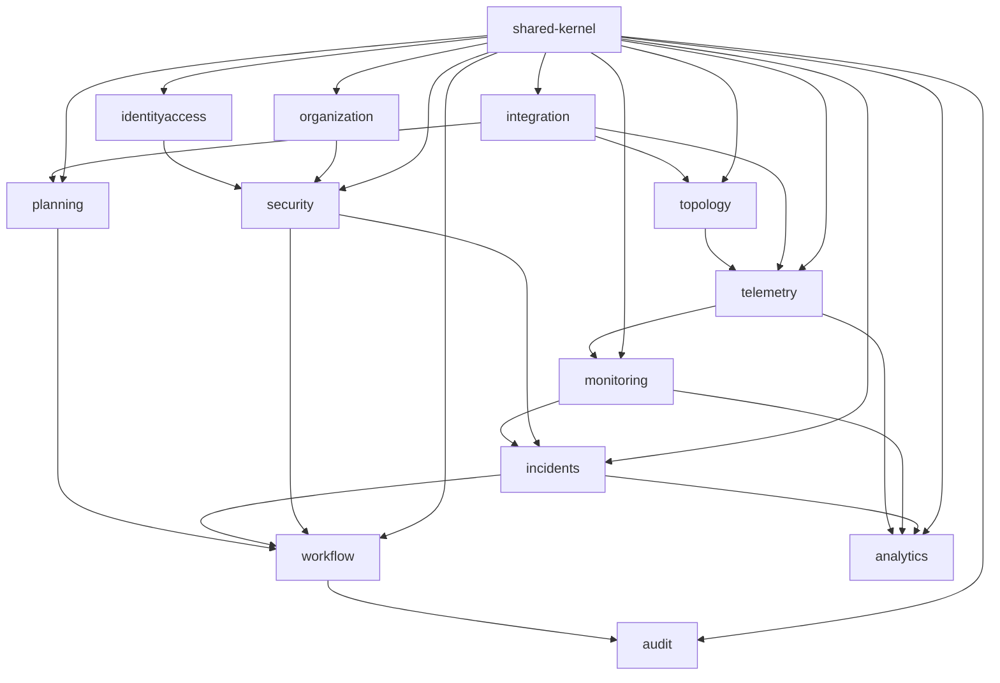

# Bounded Context Map (Target)

## Context Catalog and Responsibilities
- **topology**: physical/functional asset graph (regions, structures, pipelines, stations, sensors).
- **telemetry**: ingestion, quality, normalization, enrichment, and timeseries write.
- **planning**: plans/schedules/coverage targets and operational planning constraints.
- **monitoring**: rule evaluation, anomaly detection, KPI monitoring, alert generation.
- **incidents**: incident lifecycle, severity, root-cause metadata, closure evidence.
- **workflow**: approvals, task orchestration, SoD-aware state machine transitions.
- **analytics**: curated analytical models, trend metrics, aggregates, ML feature feeds.
- **integration**: anti-corruption and protocol adapters (SCADA, ERP, historian, CMMS).
- **audit**: immutable audit records, evidence chain, retention/export controls.
- **identityaccess**: identities, sessions, credentials, role assignment.
- **organization**: organization graph, staffing and operational scope assignments.
- **security**: authorization policies (RBAC/ABAC), policy decisions, SoD enforcement.
- **shared-kernel**: minimal core contracts/value primitives/events metadata.

## Context Relationships

## Dependency semantics
- Upstream/downstream interactions should occur through events, application ports, or published context APIs.
- Direct persistence-level sharing between contexts is forbidden.
- Shared-kernel cannot accumulate context-specific business policies.
