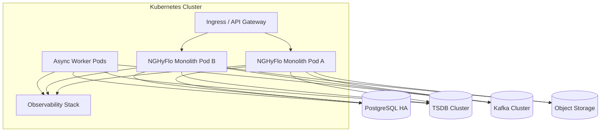

# Deployment Architecture (Target)

## Runtime model (near term)
- Single deployable modular monolith with strict module boundaries.
- Stateless app replicas behind ingress.
- Externalized state services (PostgreSQL, TSDB, Kafka, object storage).

## Kubernetes readiness
- Multi-replica deployments with HPA based on CPU + ingestion lag + queue depth.
- Dedicated worker pools for ingestion, outbox dispatch, and analytics jobs.
- Config/secrets via K8s secrets + vault integration.
- Pod disruption budgets and anti-affinity for high availability.

## Deployment architecture diagram

## Microservice extraction path
1. Extract **telemetry ingestion** first (highest throughput isolation).
2. Extract **analytics** second (compute elasticity).
3. Extract **workflow** third (independent lifecycle engine).
4. Extract **integration** adapters as connector services.

## Scalability boundaries
- Horizontal scale: API/application replicas and async workers.
- Vertical specialization: telemetry and analytics worker classes.
- Data partitioning by asset-region and time windows.
