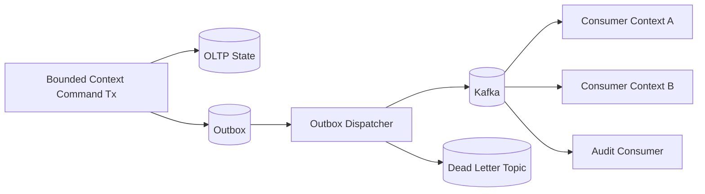

# Event-Driven Architecture (Target)

## Event taxonomy
- **Domain events**: internal facts within bounded context.
- **Integration events**: externalized cross-context/public contracts.
- **Audit events**: immutable operational/compliance trail.
- **Telemetry events**: ingestion, quality, anomaly, threshold crossing.
- **Workflow events**: lifecycle and approval transitions.

## Outbox strategy
- Per-context transactional outbox table.
- Outbox write in same transaction as aggregate state change.
- Dispatcher publishes to Kafka topics with retry + dead-letter.
- Idempotent consumers track processed event IDs.

## Event ownership rules
- Event name namespace: `<context>.<aggregate>.<past-tense-action>`.
- Only owning bounded context can publish its integration event schema.
- Consumers cannot depend on producer internal domain classes.

## Event-driven architecture diagram

## Core target topics
- `telemetry.measurement.ingested`
- `telemetry.quality.rejected`
- `monitoring.alert.raised`
- `incident.created`
- `workflow.transition.completed`
- `planning.schedule.published`
- `audit.record.captured`
