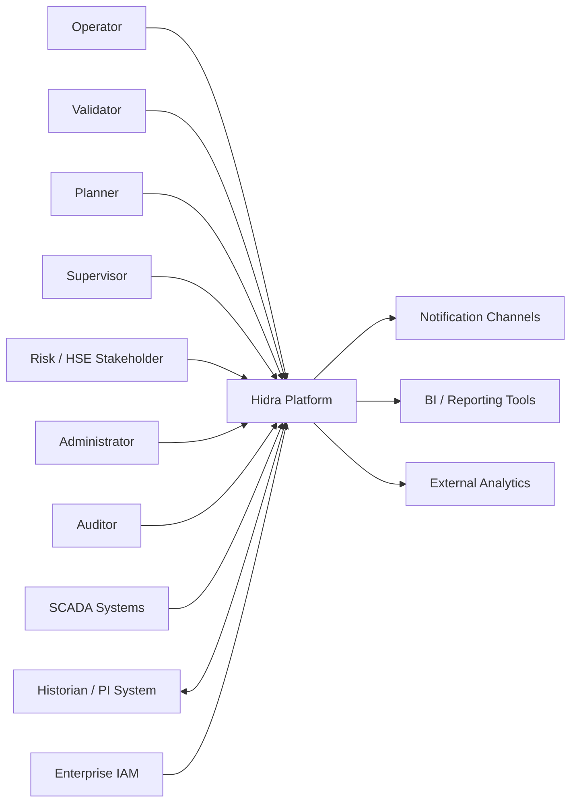
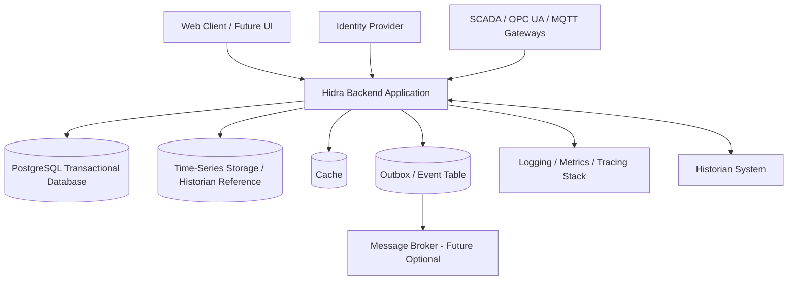

# Hidra Macro Architecture

## 1. Document Status

| Field | Value |
|---|---|
| Product | Hidra |
| Meaning | Hydrocarbon Intelligence for Data, Risk, and Analytics |
| Document type | Macro architecture |
| Version | 0.1 Draft |
| Status | For discussion |
| Target repository | HidraAPI |
| Architecture style | DDD + Hexagonal Architecture + Modular Monolith |

---

## 2. Architecture Mission

The macro architecture defines the global structure of Hidra as an enterprise-grade hydrocarbon intelligence platform for Sonatrach pipeline operations.

It must support:

- business clarity
- modularity
- data trust
- operational risk awareness
- auditability
- validation discipline
- integration readiness
- analytics readiness
- long-term digital twin readiness

---

## 3. Architecture Drivers

| Driver | Impact on architecture |
|---|---|
| Pipeline operations are domain-specific | Use Domain-Driven Design and bounded contexts |
| Data must be trusted | Introduce validation workflow and audit by design |
| Operational deviations create risk | Model monitoring, alerts, incidents, and risk indicators explicitly |
| Industrial integration will evolve gradually | Use ports/adapters and an integration context |
| Team must avoid early complexity | Start with modular monolith, not microservices |
| Future analytics require clean data | Separate operational writes from projections/read models |
| Security and accountability are critical | Centralize identity, authorization, and audit |
| Telemetry may become high-volume | Separate transactional model from time-series strategy |

---

## 4. Architecture Style

Hidra should use:

- Domain-Driven Design
- Hexagonal Architecture
- Modular Monolith first
- Event-aware internal architecture
- API-first external integration
- Clear separation of API, application, domain, infrastructure, platform, and shared-kernel layers

---

## 5. Why Modular Monolith First

Hidra should not start as microservices.

Reasons:

- business boundaries are still being consolidated
- operational workflows cross multiple domains
- deployment simplicity is important
- strong consistency is needed for validation and audit
- team velocity will be higher with one deployable unit
- modularity can be enforced without distributed-system complexity

Future extraction may be possible for:

- telemetry ingestion
- notification delivery
- analytics processing
- integration connectors
- reporting projections

Extraction must happen only after clear load, ownership, operational, and lifecycle reasons appear.

---

## 6. System Context

Hidra sits between human operational actors and industrial/enterprise systems.



---

## 7. Container Architecture



---

## 8. Canonical Bounded Contexts

| Context | Type | Responsibility | Owns | Does Not Own |
|---|---|---|---|---|
| sharedkernel | Shared foundation | Stable primitives, IDs, base value objects, result types | Cross-context primitives | Business aggregates |
| identityaccess | Core/platform | Users, roles, permissions, authorities, groups | Authentication and authorization model | Employee hierarchy |
| organization | Core | Employees, departments, operational units, structure assignments | Human/organizational structure | Login credentials |
| topology | Core | Pipeline network, infrastructure, equipment, measurement points | Physical/operational topology | Flow values |
| telemetry | Core | Flow readings, sensor readings, measurement quality, validation state | Measurement data | Incident lifecycle |
| planning | Core | Flow plans, targets, planning periods, planned vs actual comparison | Operational targets | Raw telemetry ingestion |
| monitoring | Core | Thresholds, monitoring rules, operational state, anomaly/risk signals | State interpretation | Incident resolution |
| incidents | Core | Incident lifecycle, classification, response, root cause, resolution | Incident state | Raw alert rule evaluation |
| workflow | Supporting/core | Validation and approval orchestration | Workflow instances/tasks/actions | Domain business rules |
| audit | Cross-cutting | Audit events, actor traceability, before/after values | Audit trail | Business decisions |
| integration | Supporting | External systems, connectors, ingestion jobs, mappings, retries | Integration configuration | Domain ownership |
| analytics | Supporting | KPIs, projections, trends, insights, risk analytics | Derived views | Source-of-truth state |
| notification | Supporting | Notification templates, delivery, channels | Delivery events | Alert business rules |
| reporting | Supporting | Operational reports and exports | Report definitions/projections | Source data ownership |
| platform | Technical foundation | Configuration, exception handling, observability, security plumbing | Technical services | Business concepts |

---

## 9. Dependency Rules

Allowed direction:

```text
api -> application -> domain
application -> ports
infrastructure -> ports/domain mappings
platform -> technical support
sharedkernel -> stable primitives only
```

Forbidden:

- controller directly accesses repository
- domain depends on infrastructure
- domain depends on Spring Web
- application depends on API layer
- modules share persistence entities
- sharedkernel becomes a dumping ground
- workflow owns business rules that belong to a domain
- analytics modifies source-of-truth operational state
- integration adapters bypass application/domain rules

---

## 10. Data Architecture

Hidra should distinguish between transactional data, telemetry/time-series data, audit data, event/outbox data, and projection data.

### 10.1 Transactional Data

Stored in PostgreSQL.

Examples:

- users
- roles
- employees
- topology
- workflow instances
- plans
- monitoring rules
- incidents
- audit events
- integration configuration

### 10.2 Telemetry and Time-Series Data

Initial approach:

1. Store validated operational readings in PostgreSQL for the first version.
2. Keep historian references for external systems.
3. Add dedicated time-series storage later if volume, retention, or analytics workloads require it.

The initial design must not block future time-series extraction.

### 10.3 Audit Data

Audit data must be append-only.

Audit records should include:

- actor
- action
- target
- timestamp
- correlation ID
- request ID
- before value
- after value
- decision reason
- workflow state

### 10.4 Outbox Data

Outbox records should support reliable event publication.

Fields:

- event ID
- aggregate ID
- aggregate type
- event type
- payload
- occurred at
- published at
- retry count
- status

### 10.5 Projection Data

Analytics and reporting must use projections/read models where possible.

Read models should not own business truth.

---

## 11. Integration Architecture

Integration must be port/adapter-based.

Target integration types:

- REST APIs
- SCADA adapters
- historian adapters
- OPC UA readiness
- MQTT readiness
- CSV/Excel import/export
- enterprise IAM integration
- notification gateways
- external analytics export

Integration context owns:

- connector registry
- external system definitions
- mapping rules
- ingestion jobs
- sync status
- retry policy
- dead-letter handling
- external reference tracking

---

## 12. Security Architecture

Security must support:

- authentication through internal or external IAM
- RBAC
- ABAC readiness
- organization-scoped permissions
- role and permission catalog
- authority model
- group assignment
- segregation of duties
- auditability of security decisions

Authorization should be policy-driven, not scattered across controllers.

---

## 13. Observability Architecture

Hidra must provide:

- structured logs
- correlation IDs
- request IDs
- actor IDs
- organization IDs where applicable
- module names
- operation names
- metrics
- health checks
- readiness checks
- integration job monitoring
- ingestion monitoring
- audit visibility

Sensitive data must never be logged.

---

## 14. Deployment Architecture

Initial deployment targets:

- local development
- test
- staging
- production

Required deployment concerns:

- profile-based configuration
- Flyway database migrations
- secrets management
- health and readiness endpoints
- backup and restore
- logs and metrics export
- container readiness
- CI validation

---

## 15. Macro Architecture Decisions

| Decision | Status | Rationale |
|---|---|---|
| Use modular monolith first | Proposed | Simpler deployment and stronger consistency |
| Use DDD bounded contexts | Proposed | Protect business model from technical drift |
| Use hexagonal architecture | Proposed | Keep domain independent from frameworks and integrations |
| Use PostgreSQL first | Proposed | Reliable transactional foundation |
| Delay microservices | Proposed | Avoid premature distributed complexity |
| Use outbox pattern | Proposed | Reliable internal/external event publication readiness |
| Treat analytics as projections | Proposed | Prevent derived data from becoming source of truth |
| Separate telemetry from monitoring | Proposed | Telemetry records facts; monitoring interprets state |
| Separate alerts from incidents | Proposed | Alerts indicate attention; incidents manage operational problems |
| Treat risk as cross-operational concern | Proposed | Risk signals emerge from monitoring, incidents, planning, and validation |

---

## 16. Open Architecture Questions

1. Should risk become a separate bounded context later, or remain distributed across monitoring, incidents, planning, and analytics?
2. Should notification and reporting be separate modules from the start, or introduced after operational core stabilization?
3. What is the first historian integration target?
4. What telemetry volume is expected in the first production use case?
5. Which topology elements are mandatory for version 1?
