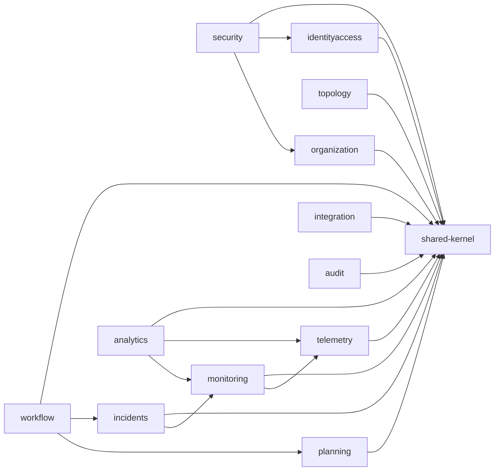

# Module Dependency Rules (Target)

## Allowed Dependencies
- `shared-kernel` -> no module dependencies.
- `security` -> `identityaccess`, `organization`, `shared-kernel`.
- `audit` -> `shared-kernel` only (consumes events from all contexts).
- Domain contexts (`topology`, `telemetry`, `planning`, `monitoring`, `incidents`, `workflow`, `analytics`, `integration`, `identityaccess`, `organization`) -> `shared-kernel`, optionally `security` contracts.

## Forbidden Dependencies
- Any context -> another context's infrastructure package.
- API layer -> infrastructure persistence implementations.
- Domain layer -> Spring/JPA/web frameworks.
- Context-to-context direct entity reference.
- Bidirectional dependencies between bounded contexts.

## Dependency Graph

## Enforcement model
- ArchUnit rules per layer and per context.
- Build fails on forbidden package dependency.
- Dependency whitelist maintained per module in architecture tests.
