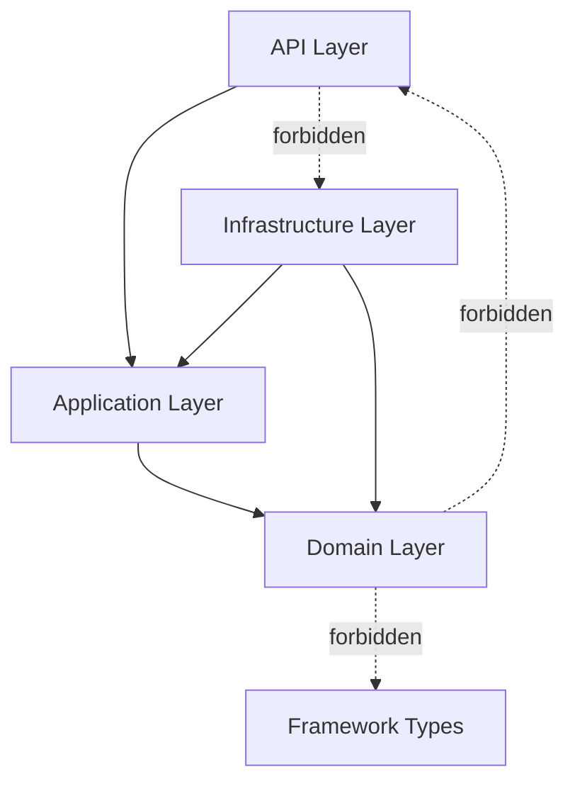

# Package Ownership Rules (Target)

## Canonical package template
`dz.sh.trc.nghyflo.modules.<context>.{api,application,domain,infrastructure}`

## Layer ownership
- `domain`: entities, aggregates, value objects, domain events, domain services, repository interfaces.
- `application`: commands/queries, handlers, orchestration, transaction boundaries, DTOs.
- `api`: controllers, transport DTOs, request validation, API mappers.
- `infrastructure`: adapters, persistence entities, messaging connectors, external integrations.

## Shared contracts
- `dz.sh.trc.nghyflo.shared.kernel` for stable cross-context abstractions only:
  - IDs that are globally ubiquitous.
  - event envelope metadata.
  - base exceptions and value-object primitives.

## Integration contracts
- `dz.sh.trc.nghyflo.modules.integration.contract` owns external protocol schemas, adapter contracts, anti-corruption mappings.
- Other modules consume integration contracts through application ports only.

## Layered architecture diagram

## Ownership guardrails
- No duplicated type names across shared-kernel and context-local packages unless explicitly aliased.
- No `*Controller` outside `.api`.
- No `Jpa*` outside `.infrastructure.persistence`.
