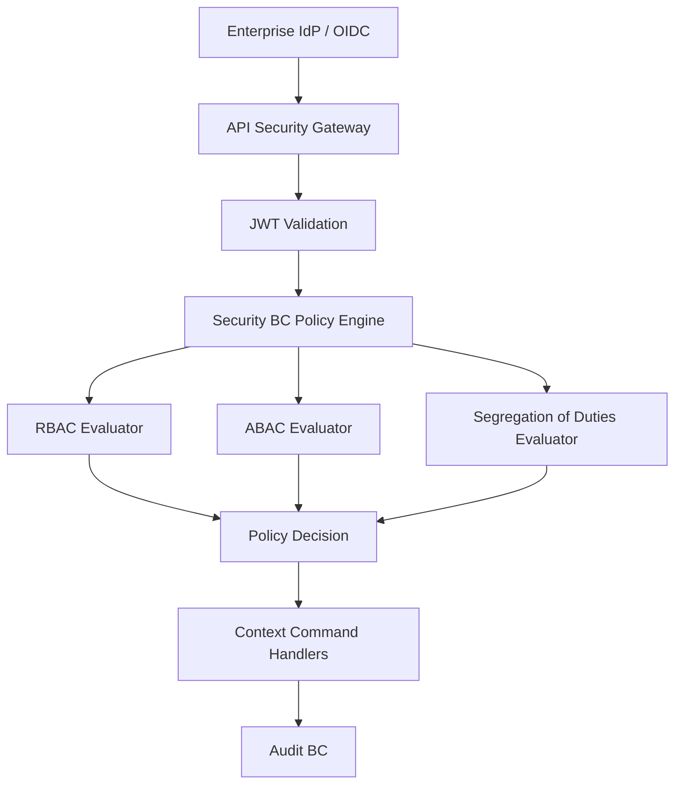

# Security Architecture (Target)

## Security model
- Identity: JWT/OIDC tokens issued by enterprise IdP and validated at entry.
- Authorization: combined RBAC + ABAC + SoD enforcement.
- Service authorization: signed service principals + mTLS for extracted services.
- Audit trail: every decision and privileged operation emits audit event.

## Security architecture diagram

## RBAC/ABAC target structure
- RBAC: role -> permission mapping in IdentityAccess + Security policy layer.
- ABAC: operational attributes (region, structure, shift, criticality, incident severity).
- SoD: explicit forbidden role/action combinations and dual-control steps.

## JWT and service auth
- JWT claims mapped to authenticated actor + organizational scope.
- Internal service-to-service calls (future extraction) require workload identity and policy checks.
