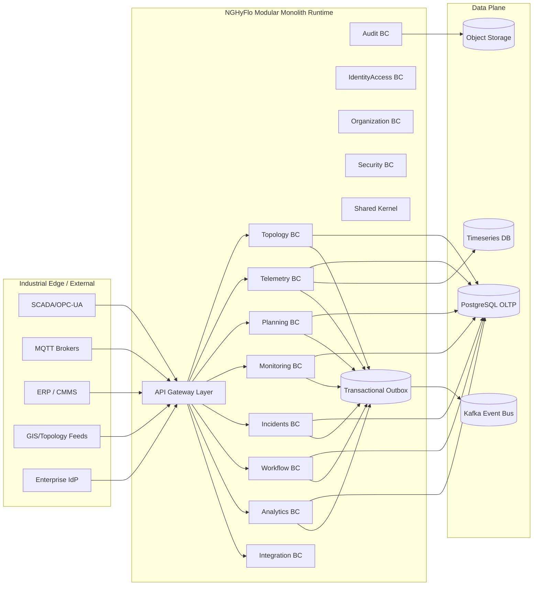

# NGHyFlo Target Architecture Overview (Phase 3)

## Architectural North Star
NGHyFlo target state is a **DDD + Hexagonal + Modular Monolith** designed for Sonatrach-scale operations, with explicit seams for progressive microservice extraction.

### Core principles
- Strict bounded contexts with explicit ownership.
- Inward dependency rule (domain/application independent from frameworks).
- CQRS-ready application layer with command/query separation by package and contracts.
- Event-driven integration via transactional outbox.
- Shared-kernel discipline (minimal, stable, ubiquitous only).
- Operational-grade observability, security, and audit-by-default.

## Macro Architecture

## Target outcomes
- High ingestion throughput and deterministic workflow processing.
- Consistent enforcement of RBAC/ABAC + segregation of duties.
- Full traceability for operational and regulatory audit.
- Predictable extraction path for high-load contexts (Telemetry, Analytics, Workflow, Integration).
