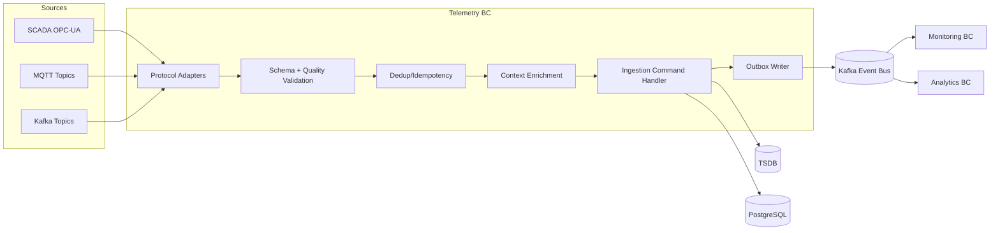

# Telemetry Architecture (Target)

## Ingestion pipeline
1. Protocol ingestion (MQTT, Kafka, OPC-UA/SCADA connectors).
2. Envelope parsing + schema validation.
3. Deduplication/idempotency using message key + source timestamp window.
4. Quality checks (range, units, sensor state, continuity).
5. Enrichment (topology binding, operational context, correlation).
6. Write path:
   - hot path -> TSDB
   - contextual state -> OLTP projections
   - event emission -> outbox

## Telemetry ingestion architecture

## MQTT / Kafka strategy
- MQTT for edge ingestion and low-latency sensor streams.
- Kafka for durable internal event backbone and backpressure smoothing.
- Bridge/adapters in Integration BC normalize protocol-specific details.

## TSDB strategy
- Partition by time + asset hierarchy.
- Retention tiers: hot operational window, warm historical, cold archive.
- Downsampling jobs feed Analytics BC aggregates.

## Monitoring flow tie-in
- telemetry.quality.failed -> Monitoring alert rule evaluation.
- telemetry.anomaly.detected -> Incident candidate creation workflow.
