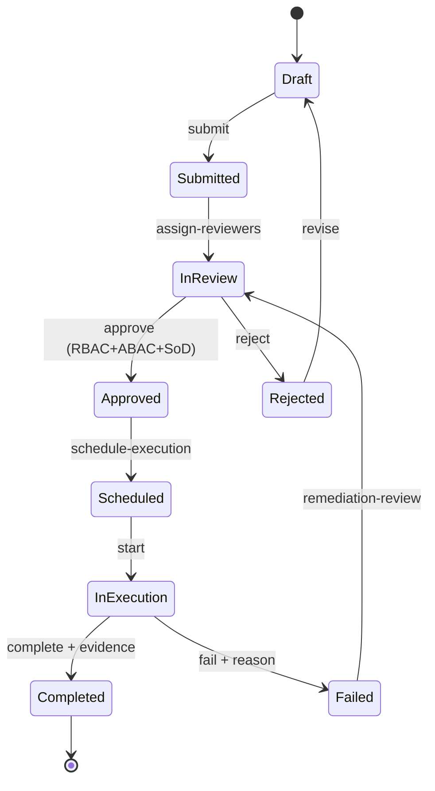

# Workflow Architecture (Target)

## Scope
Workflow BC orchestrates approvals, operational actions, incident lifecycles, and planning execution with explicit state machines and policy gates.

## Workflow lifecycle diagram

## Orchestration rules
- Command side: workflow commands mutate workflow aggregates.
- Query side: read projections for dashboard/status queries.
- All transitions emit domain events and audit events.
- Security BC policy decision required for transition commands.
- Incident and Planning contexts produce workflow triggers via integration events.

## Cross-context workflow events
- `planning.execution.requested`
- `incident.response.workflow.required`
- `workflow.step.approved`
- `workflow.execution.completed`
