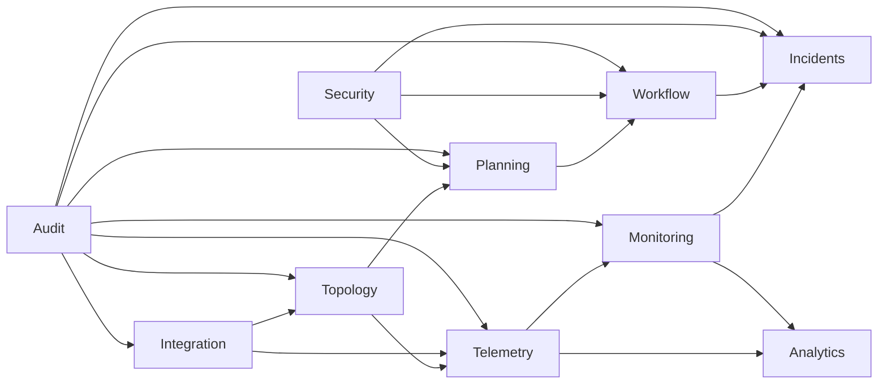

# Bounded Context Map

## Contexts and Ownership
- **topology**: pipeline assets, regions, stations, segments, structure graph.
- **telemetry**: ingestion, normalization, quality, deduplication, lineage.
- **planning**: operational plans, staffing/coverage plans, schedule constraints.
- **monitoring**: thresholds, anomaly rules, health states, KPI snapshots.
- **incidents**: alert lifecycle, incident triage, escalation, postmortems.
- **workflow**: approval processes, state machines, segregation checkpoints.
- **analytics**: derived metrics, forecasting models, operational intelligence.
- **integration**: external protocols, anti-corruption layers, connector lifecycle.
- **audit**: immutable records, evidence chain, retention/export policies.
- **security**: identity, actor context, RBAC+ABAC+SoD policy decisions.
- **shared-kernel**: generic primitives/events/interfaces only.

## Context Map (Mermaid)

