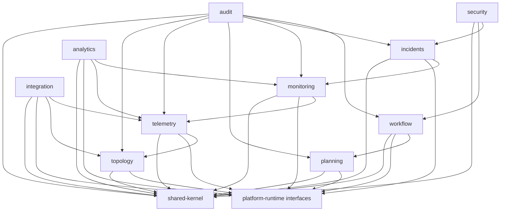

# Dependency Rules

## Core Rules
1. `shared-kernel` has **no inbound dependency** on bounded contexts.
2. Business contexts may depend on `shared-kernel` and selected `platform-runtime` interfaces only.
3. Context-to-context calls are **application-port only** (no direct repository/entity access).
4. Integration adapters depend inward on integration ports; never reverse.
5. Controllers never call repositories directly.
6. Domain layer cannot depend on infrastructure layer.
7. Cross-context data exchange is DTO/event contract only.
8. All external publication flows through outbox/eventing module.

## Module Dependency Graph (Mermaid)

