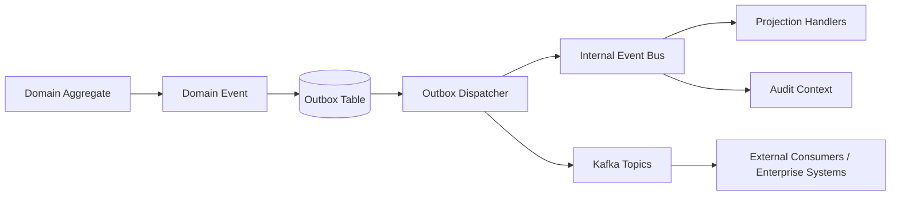

# Event-Driven Architecture

## Model
- Internal domain events per context.
- Context integration events emitted through outbox.
- Event routing via internal bus + Kafka bridge.
- Idempotency keys required for consumers.

## Event Taxonomy
- **Operational Events**: plan approved, coverage adjusted, incident escalated.
- **Telemetry Events**: sample ingested, quality rejected, threshold breached.
- **Security Events**: login, token refresh, authorization denied, SoD violation.
- **Audit Events**: record chained, evidence exported.

## Event Architecture (Mermaid)

## Contract Rules
- Versioned event schemas (`eventType`, `version`, `tenant`, `correlationId`, `causationId`).
- Backward-compatible evolution only.
- No entity serialization in payloads; events carry immutable facts.
