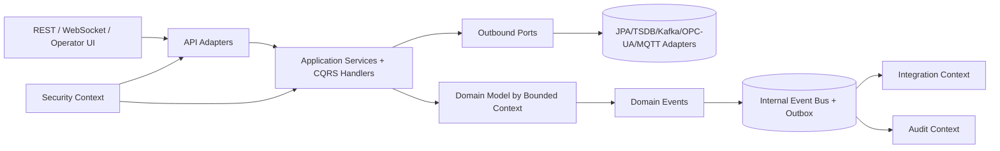
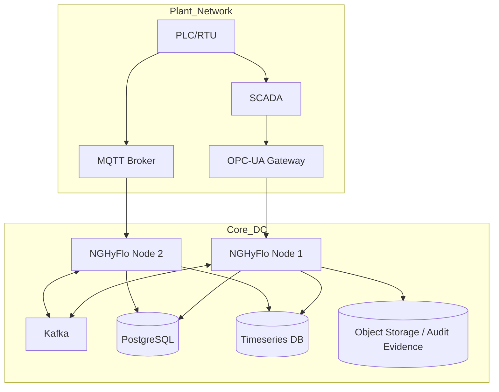

# Final Modular Architecture

## Vision
NGHyFlo evolves into a **DDD + Hexagonal + Modular Monolith** platform with strict bounded contexts and integration seams that are microservice-ready.

## Final Module Hierarchy

```text
nghyflo
├─ bootstrap
├─ shared-kernel
├─ platform-runtime
│  ├─ audit
│  ├─ security
│  ├─ eventing
│  ├─ observability
│  └─ tenancy
├─ modules
│  ├─ topology
│  ├─ telemetry
│  ├─ planning
│  ├─ monitoring
│  ├─ incidents
│  ├─ workflow
│  ├─ analytics
│  └─ integration
└─ edge-adapters
   ├─ scada-opcua
   ├─ scada-mqtt
   ├─ enterprise-kafka
   └─ historian-connectors
```

## Macro Architecture (Mermaid)


## Deployment Architecture (Mermaid)

