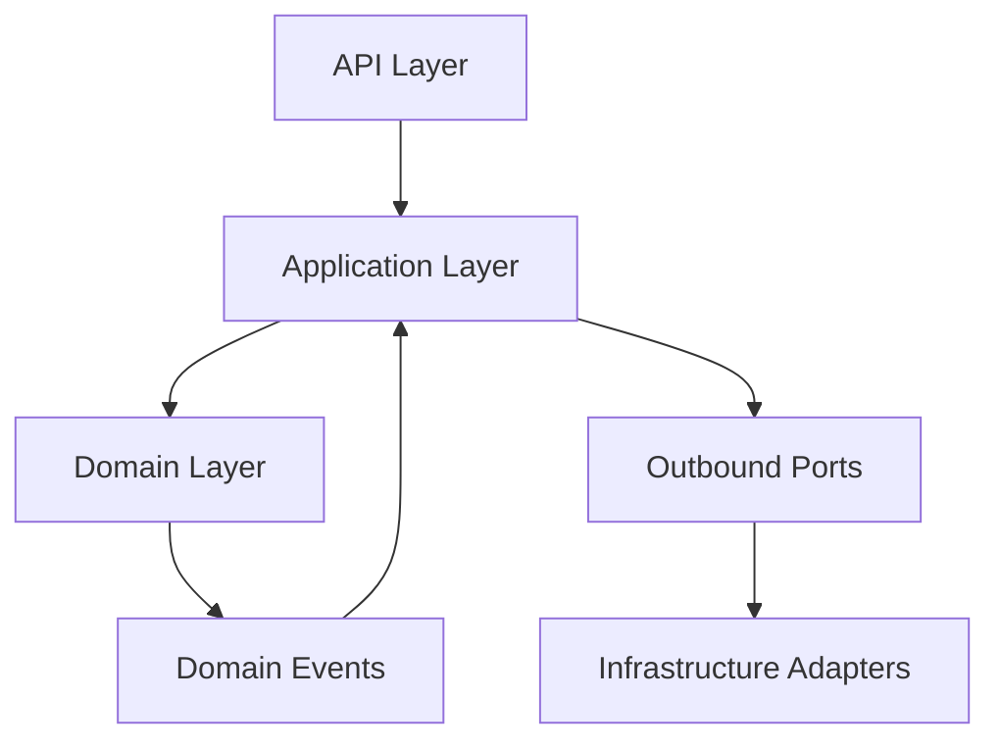

# Layering Rules

## Standard Layers per Context
1. **API Layer**: controllers, transport DTOs, validation.
2. **Application Layer**: use cases, transactions, command/query handlers.
3. **Domain Layer**: rules, aggregates, value objects, domain events.
4. **Infrastructure Layer**: database/messaging/protocol adapters.

## Layered Architecture (Mermaid)

## CQRS-Ready Rules
- Commands mutate aggregate roots via application services.
- Queries read projections/read models.
- Read models may be context-local denormalized tables.
- Event handlers update projections asynchronously (eventual consistency allowed).
