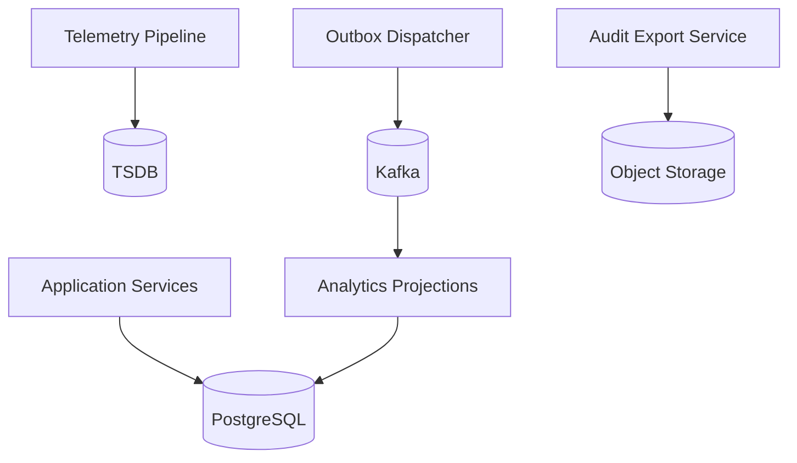

# Persistence Architecture

## Storage Strategy
- **Relational (PostgreSQL)**: transactional aggregates, workflow state, security policy metadata, outbox.
- **TSDB**: high-volume telemetry measurements and rollups.
- **Event Storage**: durable outbox + topic retention for replay.
- **Object Storage**: audit evidence bundles and exports.

## Persistence Topology (Mermaid)

## Rules
- One transactional boundary per command use-case.
- Outbox write in same RDB transaction as aggregate changes.
- TSDB writes are append-only with quality flags.
- Query/read models may be rebuilt from event streams.
- Retention policy differs: telemetry hot/cold tiers; audit WORM policy.
