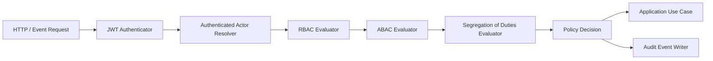

# Security Architecture

## Security Core
- JWT authentication at ingress.
- Actor resolution from JWT + tenancy context.
- Authorization pipeline: RBAC → ABAC → SoD checks.
- Policy decision point emits structured decision records.

## Security Architecture (Mermaid)

## Required Controls
- **RBAC**: role-to-permission mapping per context.
- **ABAC**: asset scope, region, shift, operation class, risk class.
- **JWT**: short-lived access tokens + refresh rotation.
- **Actor Resolution**: immutable actor identity + delegated/impersonation flags.
- **SoD**: block self-approval and conflicting role combinations.

## Security Boundaries
- Security context owns policy composition; modules own resource semantics.
- No module bypass of policy engine.
