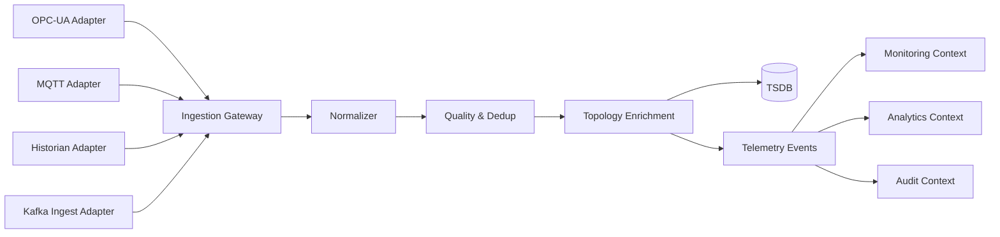

# Telemetry Ingestion Architecture

## Ingestion Pipeline
1. Protocol intake (OPC-UA, MQTT, historian pull, Kafka ingest).
2. Parsing and canonical normalization.
3. Quality validation (range, timestamp skew, duplicate suppression).
4. Enrichment (topology mapping, unit harmonization).
5. Persistence to TSDB + event publication.
6. Monitoring rules trigger alerts/incidents.

## Telemetry Ingestion (Mermaid)

## SCADA/Industrial Constraints
- Exactly-once effect at domain boundary via idempotency key.
- Store raw packet hash for forensic replay.
- Distinguish measurement time vs ingestion time.
