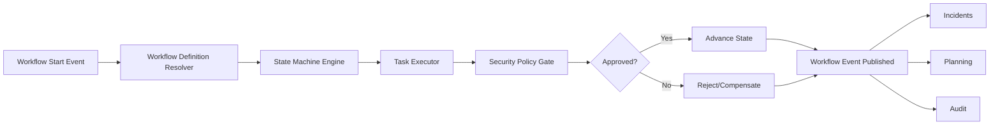

# Workflow Architecture

## Orchestration Model
- Workflow context provides long-running process orchestration.
- State machine per workflow type (approval, incident escalation, maintenance permit).
- Compensation actions for failure paths.
- Human task + automated gate hybrid.

## Workflow Orchestration (Mermaid)

## Workflow Rules
- Workflow definitions versioned and immutable after activation.
- SoD checks mandatory for approval states.
- SLA timers integrated with scheduler and incident escalation.
